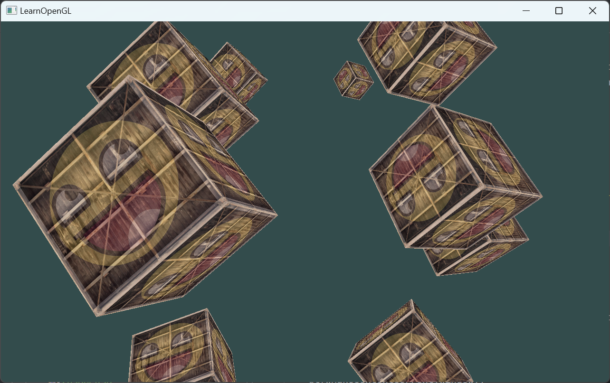
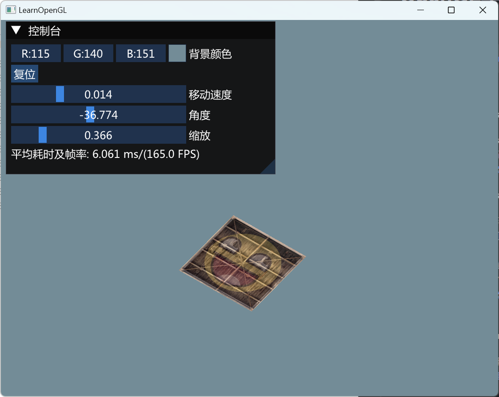
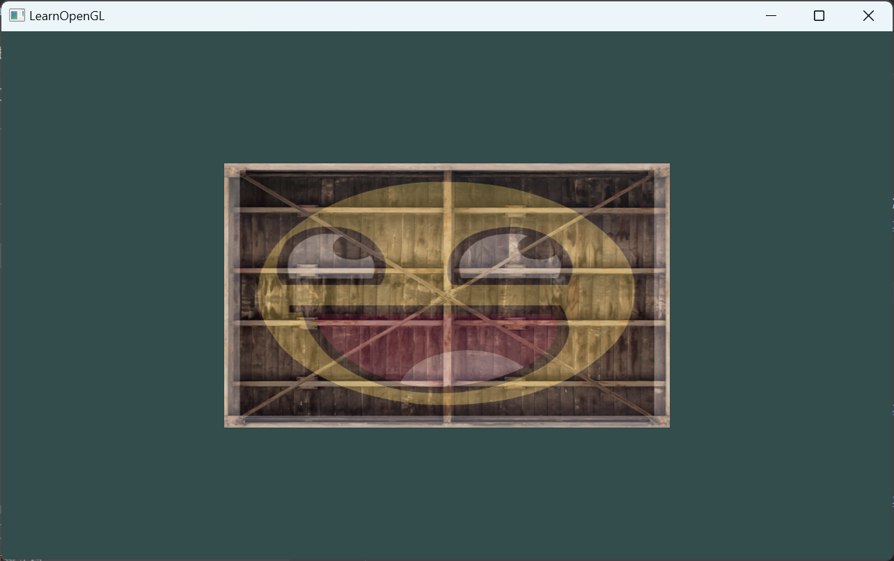
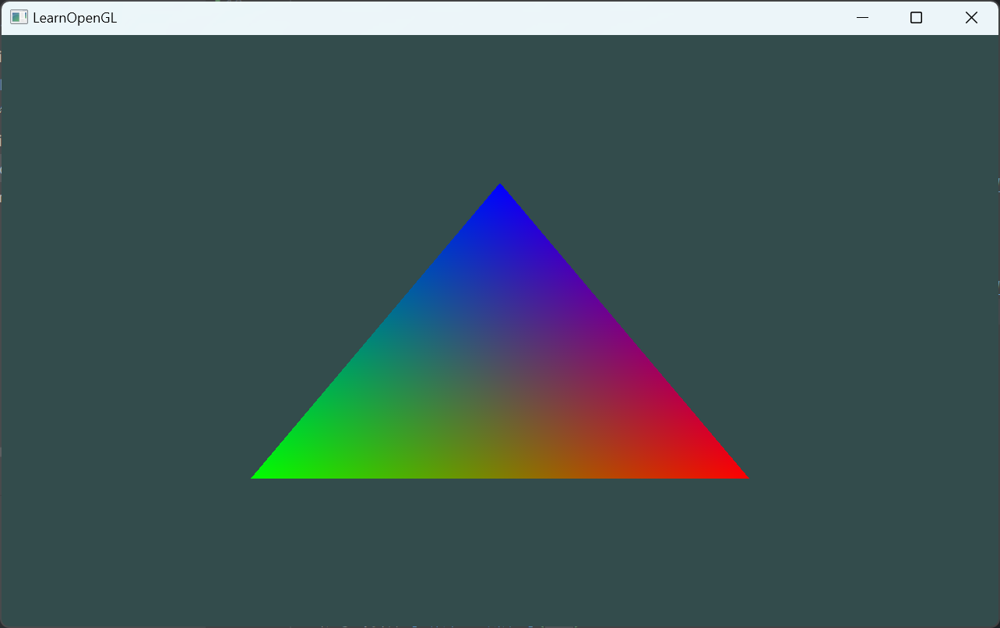
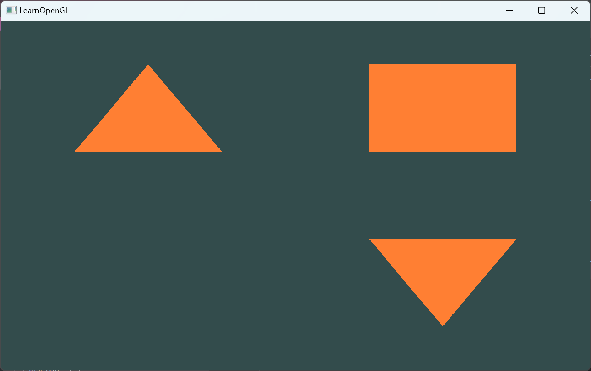
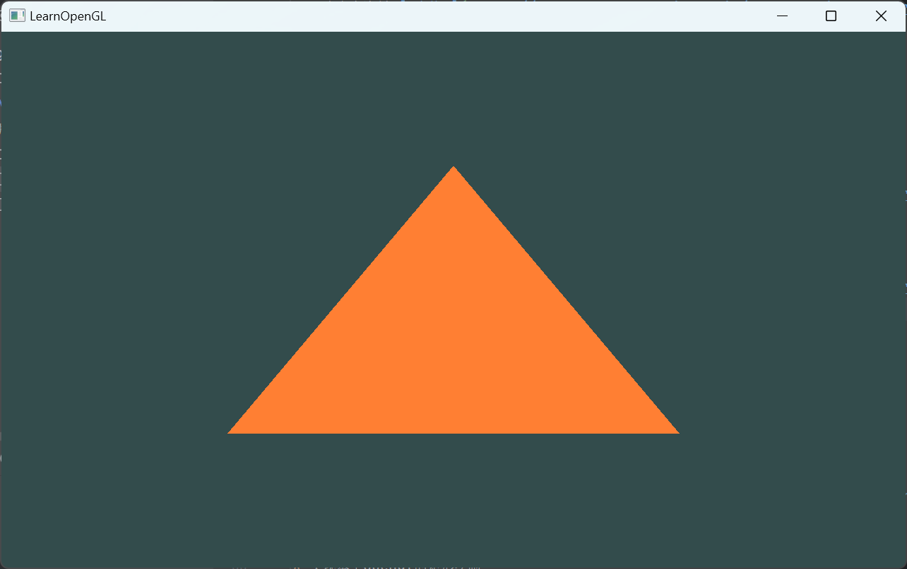

# OpenGL学习笔记

#### 介绍
> 参考资料: https://learnopengl-cn.github.io/

####  更新日志

**工程: example_8_coordinate_systems**  *20231123*

* 实现模型矩阵,视图矩阵和透射矩阵的复合应用;
* 对应参考资料 [<坐标系统>](https://learnopengl-cn.github.io/01%20Getting%20started/08%20Coordinate%20Systems/)

**工程: example_7_transformations2**  *20231123*

* 在example_7_transformations的基础上, 添加imgui库实现其部分属性的配置;
* 对应参考资料 [<变换>](https://learnopengl-cn.github.io/01%20Getting%20started/07%20Transformations/)

**工程: example_7_transformations**  *20231123*

* 导入glm库实现矩阵计算的支持;
* 实现对OpenGL几何图形的矩阵计算,实现其平移,旋转,缩放等操作;
* 实现顶点、纹理等参数放在不同的对象中的构造尝试(1个VAO对应多个VBO);
* 对应参考资料 [<变换>](https://learnopengl-cn.github.io/01%20Getting%20started/07%20Transformations/)

**工程: example_6_textures**  *20231122*

* 实现纹理的初步应用;
* 对应参考资料 [<纹理>](https://learnopengl-cn.github.io/01%20Getting%20started/06%20Textures/)

**工程: example_5_shader**  *20231122*

* 实现着色器的封装;
* 实现着色器的进一步应用;
* 对应参考资料 [<着色器>](https://learnopengl-cn.github.io/01%20Getting%20started/05%20Shaders/)

**工程: example_4_rectangle**  *20231122*

* 实现基于opengl的矩形绘制;
* 着色器的初步应用;
* 实现多个VAO对象的切换;
* 对应参考资料 [<你好，三角形>](https://learnopengl-cn.github.io/01%20Getting%20started/04%20Hello%20Triangle/)

**工程: example_3_triangle**  *20231121*

* 实现基于opengl的三角形绘制;
* 着色器的初步应用;
* 对应参考资料 [<你好，三角形>](https://learnopengl-cn.github.io/01%20Getting%20started/04%20Hello%20Triangle/) 

**工程: example_2_window**  *20231121*

* 使用 glfw 和 glad 来实现窗口创建;
* 对应参考资料 [<你好，窗口>](https://learnopengl-cn.github.io/01%20Getting%20started/03%20Hello%20Window//)

**工程: example_1_window**  *20231121*

* 使用 glfw 和 opengl32 来实现窗口创建;

-------
